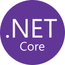

# Hey 👋 I'm Manh Khang Vu

Welcome to My GitHub Profile!

## About me

📚 I am currently enrolled in the Computer Programming and Analysis program at Fanshawe College, where I have developed a strong foundation in mathematics, programming, databases, networking, and systems analysis.

✨ As a mathematically gifted student at Le Hong Phong High School for the Gifted, one of Vietnam's most prestigious schools for gifted students, I have confidence in my mathematical knowledge, logical thinking, and problem-solving abilities.

💼 I have worked across both development and IT environments, with experience supporting enterprise devices and user accounts using tools like Azure AD (now Entra ID), Intune, Exchange, and ADUC; automating Windows deployments with unattended files and Autopilot; and providing comprehensive Tier 1 support through the Ivanti ticketing system. Previously, as an Information Systems IoT, I worked with virtualization platforms (_e.g.,_ Hyper-V, VMware vSphere), standardized WSL environments with integrated security, and implemented Infrastructure as Code (IaC) tools such as Ansible and Terraform to automate  and streamline system configuration management.

## Skills

### Languages

  
  
  
  
  
  
  
  
  
  
  
  
  
    
  
   
  
  
  
  
  
  
  

### Databases

  
  
  
  
  

### Platforms & Tools

  
  
  
  
  
  
  
  
  

## Connect with Me

  
  
  
  
  

<!-- ## Statistics

  
  
  

 -->

<!-- ### Back-End

  
  
  
  
  
  
  
  
  
  
  

### Front-End

  
    
  
   
  
  
  
  
  
  
  

 -->

<!--
**khangvum/khangvum** is a ✨ _special_ ✨ repository because its `README.md` (this file) appears on your GitHub profile.

Here are some ideas to get you started:

- 🔭 I’m currently working on ...
- 🌱 I’m currently learning ...
- 👯 I’m looking to collaborate on ...
- 🤔 I’m looking for help with ...
- 💬 Ask me about ...
- 📫 How to reach me: ...
- 😄 Pronouns: ...
- ⚡ Fun fact: ...
-->
