# Hey 👋 I'm Manh Khang Vu

Welcome to My GitHub Profile!

## About me

📚 I am currently enrolled in the Computer Programming and Analysis program at Fanshawe College, where I have developed a strong foundation in mathematics, programming, databases, networking, and systems analysis.

✨ As a mathematically gifted student at Le Hong Phong High School for the Gifted, one of Vietnam's most prestigious schools for gifted students, I have confidence in my mathematical knowledge, logical thinking, and problem-solving abilities.

💼 Professional Experience:

**Automation Test Developer | CARFAX Canada**

- Engineered automated test cases with Selenium WebDriver and NUnit/MSTest.

**NSC Support Analyst - Tier 1 | EMCO Corporation**

- Managed enterprise infrastructure with Entra ID (Azure AD), Intune, and Exchange.
- Automated Windows deployments using Autopilot and answer files (_e.g.,_ [khangvum/answer-files](https://github.com/khangvum/answer-files)).
- Provided comprehensive Tier 1 support through the Ivanti ticketing system.

**Information Systems IoT | Eramosa - A CIMA+ Company**

- Engineered a standardized, security-hardened WSL environment (_e.g.,_ [khangvum/nixos-wsl](https://github.com/khangvum/nixos-wsl)).
- Implemented Infrastructure as Code (IaC) using Ansible and Terraform (_e.g.,_ [khangvum/homelab-ansible-config](https://github.com/khangvum/homelab-ansible-config)).
- Orchestrated multi-tenant virtual infrastructure across VMware ESXi and Hyper-V.

## Skills

### Languages

  
  
  
  
  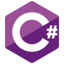
  
  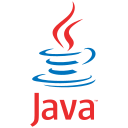
  
  
  
  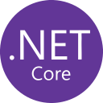
  
  
  
  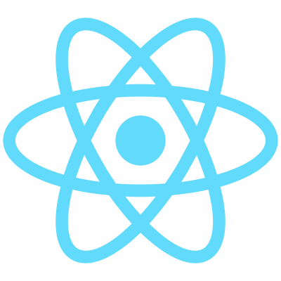
  
  
    
  
   
  
  
  
  
  
  
  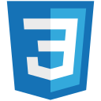
  
  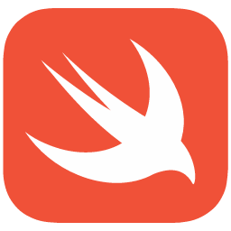
  
  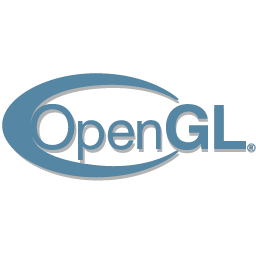

### Databases

  
  
  
  
  
  
  
  
  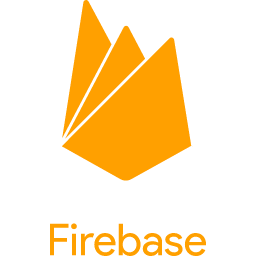

### Infrastructure

  
  
  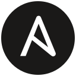
  
  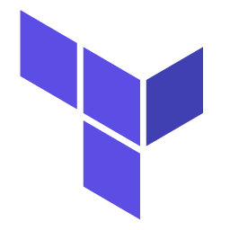
  
  
  
  
  
  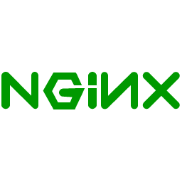
  

### DevOps Tools

  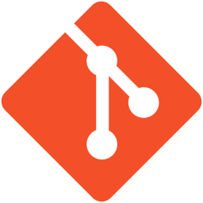
  
  
  
  
  
  
  
  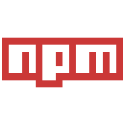
  
  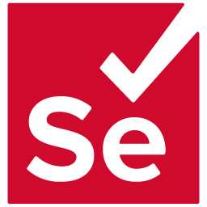
  
  
  

## Connect with Me

  
  
  
  
  

<!-- ## Statistics

  
  
  

 -->

<!-- ### Back-End

  
  
  
  
  
  
  
  
  
  
  

### Front-End

  
    
  
   
  
  
  
  
  
  
  

 -->

<!--
**khangvum/khangvum** is a ✨ _special_ ✨ repository because its `README.md` (this file) appears on your GitHub profile.

Here are some ideas to get you started:

- 🔭 I’m currently working on ...
- 🌱 I’m currently learning ...
- 👯 I’m looking to collaborate on ...
- 🤔 I’m looking for help with ...
- 💬 Ask me about ...
- 📫 How to reach me: ...
- 😄 Pronouns: ...
- ⚡ Fun fact: ...
-->
