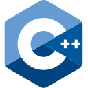
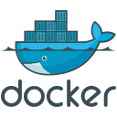

# Hey 👋 I'm Manh Khang Vu

Welcome to My GitHub Profile!

## About me

📚 I am currently enrolled in the Computer Programming and Analysis program at Fanshawe College, where I have developed a strong foundation in mathematics, programming, databases, networking, and systems analysis.

✨ As a mathematically gifted student at Le Hong Phong High School for the Gifted, one of Vietnam's most prestigious schools for gifted students, I have confidence in my mathematical knowledge, logical thinking, and problem-solving abilities.

💼 From January to April 2025, I worked as an Information Systems IoT Co-op at Eramosa - A CIMA+ Company, where I applied OSI model knowledge to network and interconnect applications across virtualization platforms like Hyper-V and VMware vSphere, worked with various operating systems, including Windows, Linux, and VMware, and utilized Infrastructure as Code (IaC) tools such as Ansible and Terraform to automate and manage system configurations.

## Skills

  
  
  
  
  
  
  
  
  
  
  
  
  
  
  
  
  
  
  
  
  
  
  
  
  

## Connect with Me

  
  
  

<!--
**khangvum/khangvum** is a ✨ _special_ ✨ repository because its `README.md` (this file) appears on your GitHub profile.

Here are some ideas to get you started:

- 🔭 I’m currently working on ...
- 🌱 I’m currently learning ...
- 👯 I’m looking to collaborate on ...
- 🤔 I’m looking for help with ...
- 💬 Ask me about ...
- 📫 How to reach me: ...
- 😄 Pronouns: ...
- ⚡ Fun fact: ...
-->
